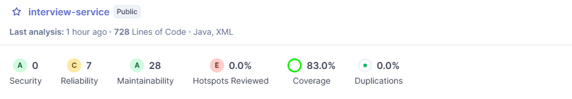

# Interview Service (Microservicio de Entrevistas)

Este microservicio, desarrollado en Java con Spring Boot, es responsable de gestionar el proceso de entrevistas. Su función principal es operar de manera asíncrona, escuchando eventos de Kafka que indican cuándo una oferta de trabajo se ha cerrado y tiene candidatos listos para ser entrevistados.

A partir de estos eventos, el servicio crea las sesiones de entrevista, genera enlaces seguros y únicos para las salas de reunión virtuales y persiste la información en su propia base de datos.

## ✨ Características Principales

*   **Arquitectura Orientada a Eventos:** Consume eventos del topic `interview-topic` de Kafka, desacoplando el proceso de creación de entrevistas de otros servicios (como el `offer-service`).
*   **Gestión de Entrevistas:** Crea y almacena registros de entrevistas, asociando a los participantes aceptados con una oferta de trabajo específica.
*   **Generación de Enlaces Seguros:** Utiliza un algoritmo de cifrado (AES) para generar un enlace único y seguro para cada sala de entrevista virtual, garantizando la privacidad.
*   **Persistencia de Datos:** Utiliza una base de datos MySQL para almacenar la información de las entrevistas.
*   **API REST Documentada:** Expone una API para consultar el estado y los detalles de las entrevistas.

## 🛠️ Tecnologías Utilizadas

*   **Lenguaje:** Java 17+
*   **Framework:** Spring Boot 3
*   **Mensajería:** Apache Kafka (Spring for Kafka)
*   **Acceso a Datos:** Spring Data JPA / Hibernate
*   **Base de Datos:** MySQL
*   **Build Tool:** Maven / Gradle
*   **Contenerización:** Docker

## 🏗️ Arquitectura y Flujo de Trabajo

1.  **Evento de Entrada:** Un servicio externo (ej. `offer-service`) publica un mensaje en el topic `interview-topic` cuando una oferta se llena. Este mensaje contiene el ID de la oferta, el email del administrador y la lista de IDs de los usuarios aceptados (`InterviewEventDto`).
2.  **Consumo y Procesamiento:** El `interview-service` consume este mensaje.
3.  **Creación de Entidad:** Se crea una nueva entidad de `Interview` en la base de datos MySQL.
4.  **Generación de Enlace:** Se genera un enlace único para la sala de entrevistas (ej. `http://localhost:5173/room?data=...`) donde el parámetro `data` es una cadena cifrada con AES que contiene la información de la sesión.
5.  **Notificación (Opcional):** El servicio puede usar su propio `KafkaProducer` para publicar un nuevo evento (ej. en un `notification-topic`) con los detalles de la entrevista y el enlace generado, para que el `notification-service` se lo comunique a los usuarios.
## 🏛️ Arquitectura de Despliegue y Criterios de Calidad

El despliegue de este microservicio está diseñado bajo principios de aislamiento y seguridad, asegurando que cada componente tenga responsabilidades y accesos bien definidos.

*   **Entorno de Ejecución:**
    *   El `interview-service` se despliega en una **Máquina Virtual (VM) dedicada**.
    *   Se empaqueta como un archivo **WAR** o **JAR** ejecutable.

*   **Aislamiento de la Base de Datos:**
    *   La base de datos **MySQL** del servicio se ejecuta en un **contenedor Docker** que reside en la **misma Máquina Virtual**.
    *   **Criterio de Seguridad:** El puerto de la base de datos no se expone fuera de la VM. El contenedor está configurado para aceptar conexiones **únicamente desde el host local (`localhost`)**, garantizando que solo el `interview-service` pueda acceder a sus datos y protegiéndola de accesos no autorizados desde la red.

*   **Dependencias de Mensajería (Kafka):**
    *   Para consumir los eventos de entrevistas, el servicio se conecta a un clúster de **Apache Kafka**.
    *   **Arquitectura Distribuida:** Los brokers de **Kafka y Zookeeper no residen en esta VM**. Están ubicados en la máquina virtual dedicada al **`notification-service`**. Esto centraliza la infraestructura de mensajería, pero requiere que la configuración (`kafka.bootstrap-servers`) apunte a la dirección de red de dicha máquina.

*   **Punto de Entrada Único (API Gateway):**
    *   **Criterio de Seguridad:** El microservicio **no expone su API directamente**. Todo el tráfico HTTP entrante debe ser enrutado y validado a través de un **API Gateway**. Este actúa como una fachada de seguridad, gestionando la autenticación, autorización, enrutamiento y limitación de peticiones antes de que lleguen al servicio.

## diagrama de clases

## este esta cubierto por sonarquebe

